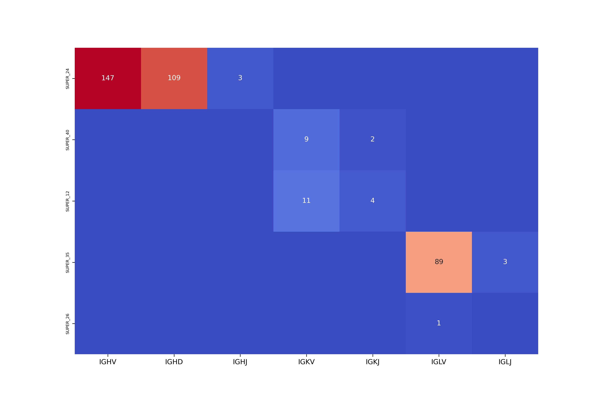
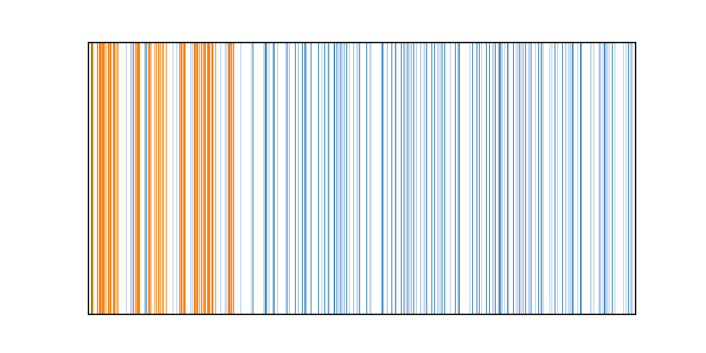

# IgDetective
a tool for annotation of variable (V), diversity (D), and joining (J) immunoglobulin genes in genomes.

## System Requirements
* Anaconda package manager 4.8.4 or higher. To install Bioconda, see the [setup guide](https://bioconda.github.io/user/install.html#install-conda).
* Minimap2. To install Minimap2, see the [setup guide](https://anaconda.org/bioconda/minimap2).
* We have benchmarked IGDetective on Linux systems.  

## Usage
IGDetective takes a genome in FASTA format as an input and operates in three stages:
* Identifying contigs containing IG gene matches. This step is performed using minimap2 and usually takes several minutes. 
* Detecting putative gene candidates using RSS matches. 
* Refining genes candidates using the iterative mode. 

To run IGDetective, type:
```
python run_iterative_igdetective.py genome.fasta output_dir
```
Please note that **IGDetective overwrites the output directory**, so make sure that it does not contain important files.

## Output format
### Gene files
IGDetective reports three txt files containing information about detected V, D, and J genes from three IG loci: IGH, IGK, and IGL:
* `output_dir/combined_genes_IGH.txt`
* `output_dir/combined_genes_IGK.txt`
* `output_dir/combined_genes_IGL.txt`

Each file represents a table describing detected genes using the following columns:
* Locus: IGH / IGK / IGL.
* GeneType: V / D / J.
* Contig: the ID of contig contaning the corresponding gene. 
* Pos: a 0-based position in the contig corresponding to the detected gene.
* Strand: + (direct) or - (reverse-complementary).
* Sequence: the nucleotide sequence of the gene.
* Productive (for V genes only!): True / False depending on whether or not the nucleotide gene sequence can translated without stop codons. 

Examples of the txt files can be found in [examples/mDicBic1_igdetective](examples/mDicBic1_igdetective).

### Summary plot
The summary plot `output_dir/summary.png` illustrates counts of the detected genes across all IG loci and contigs. The example of the summary plot for the black rhinoceros genome ([mDicBic1](https://genomeark.github.io/genomeark-all/Diceros_bicornis.html), the maternal assembly) is shown below:


### Position plots
The subdirectory `output_dir/position_plots` contains plots showing positions of IG genes found on the same contig. The position plot for the black rhinoceros IGH locus located on the contig `SUPER_24` is shown below:



Each bar represents an IG gene, colors distinguish genes of different types: 
* blue: V, dark blue / light blue = productive / non-productive V gene),
* orange: D,
* green: J.

Positions of IG genes are shown within a range from the leftmost IG gene to the rightmost IG gene.

## Development
We are actively working to make IGDetective better. Please report any bugs to GitHub. 

We also welcome your comments and suggestions on IGDetective. Please feel free to send it to Vikram Sirupurapu (vsirupur@ucsd.edu) and/or Yana Safonova (ysafonova@cs.jhu.edu).
